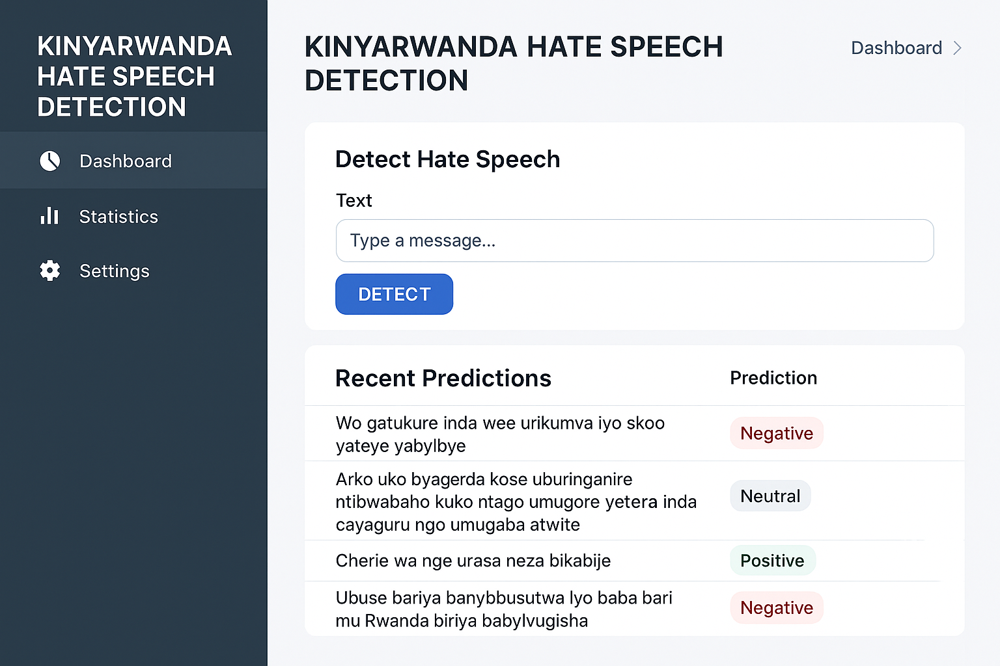

# Kinyarwanda_hatespeech_Detection_InitialSol

## 📖 Description

The **Kinyarwanda Hate Speech Detection** project builds a machine learning system to identify hate speech in Kinyarwanda social media text, supporting safer online communities in Rwanda. It classifies tweets as negative (~35%), neutral (~38%), or positive (~27%) using:

- **Logistic Regression with TF-IDF**: Baseline model, ~56–57% accuracy, ~0.57 F1-macro.
- **XLM-RoBERTa**: Transformer model with class weights `[2.86, 2.63, 3.70]`, ~52% accuracy.

Features:
- **Preprocessing**: Removes URLs, mentions, special characters, Kinyarwanda stopwords.
- **Visualizations**: Pie charts, boxplots, histograms, word clouds, n-grams (e.g., `mubi`, `neza`).
- **Tokenization**: Verified with XLM-RoBERTa.
- **Deployment**: Streamlit app with Kinyarwanda UI.

Future work possibility: KinyaBERT, lightweight augmentation.

## 🔗 GitHub Repository

[https://github.com/Umutoniwasepie/Kinyarwanda_hatespeech_InitialSol](https://github.com/Umutoniwasepie/Kinyarwanda_hatespeech_InitialSol)

## 🛠️ How to Set Up the Environment and Project

### Environment Setup
- **Kaggle**:
  - Create a notebook with Python 3.11, T4 x2 GPU.
  - Upload `notebook/kinyarwanda-hatespeech.ipynb`.
  - Add dataset “kinyarwanda-hate-speech-data” (`/kaggle/input/data/`).
- **Local**:
  - Use Python 3.11.
  - Open `notebook/kinyarwanda-hatespeech.ipynb` in VS Code/Jupyter.
  - Place `train.tsv`, `dev.tsv`, `test.tsv` in `data/`.
  - Install dependencies from `requirements.txt`.

### Project Setup
1. Clone: `git clone https://github.com/Umutoniwasepie/Kinyarwanda_hatespeech_InitialSol.git`
2. Data: Verify `data/` has `train.tsv` (3302 samples), `dev.tsv` (827), `test.tsv` (1026).
3. Notebook: Run `kinyarwanda-hatespeech.ipynb` in Kaggle (~30–60 min).
4. App: Run `streamlit run app/app.py`, test tweets (e.g., “umuntu mubi”).

## 🎨 Designs

### Figma Mockup
- **Description**: UI with 200x100px text area (“Andika ubutumwa...”), “Gusuzuma” button, prediction table, “Tanga” feedback button. White background, Roboto font.
- **File**: [designs/figma_mockup.png](designs/Figma_mockup.png)

### Streamlit App Screenshots
- **Main Interface**: Prediction for “umuntu mubi” (“Negative”).
- **Feedback**: “Tanga” button with feedback.
- **Files**:

## 🚀 Deployment Plan

- **Prototype**: Host on [Streamlit Cloud](https://streamlit.io/cloud) via GitHub.
- **Production**: AWS EC2/GCP Compute Engine with Docker, Kubernetes for scaling.
- **Optimization**: Distill XLM-RoBERTa (~100–200ms inference).
- **Monitoring**: Feedback logs to PostgreSQL (AWS RDS/GCP Cloud SQL).
- **Scalability**: Auto-scaling, Redis caching.

## 🎥 Video Demo

[https://screenrec.com/share/SfGRWq0A2a](https://screenrec.com/share/SfGRWq0A2a)

## 🙏 Acknowledgments

- **Dataset**: afrisenti-semeval/AfriSenti Dataset.
- **Libraries**: Hugging Face, PyTorch, Streamlit.
